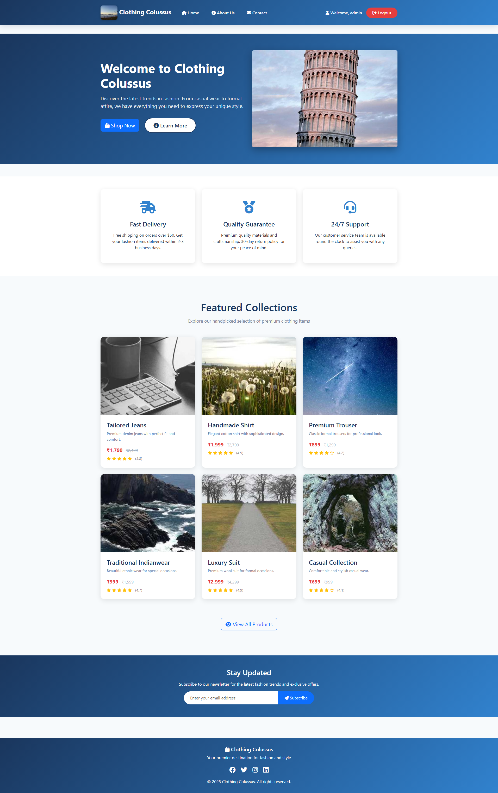

# Django E-Commerce

A modern, responsive e-commerce website built with Django featuring user authentication, product showcase, and contact forms.



## 🌟 Features

- **Modern UI/UX Design**: Clean, responsive design with Bootstrap 5 and custom CSS
- **User Authentication**: Login/logout functionality with Django's built-in auth system
- **Product Showcase**: Beautiful product cards with hover effects and ratings
- **Contact Form**: Functional contact form with backend processing
- **Stock Images**: Uses Picsum Photos for reliable, high-quality stock images
- **Responsive Design**: Mobile-friendly layout that works on all devices
- **Professional Styling**: Modern color scheme with CSS variables and gradients

## 🛠️ Technologies Used

- **Backend**: Django 4.x
- **Frontend**: HTML5, CSS3, JavaScript
- **CSS Framework**: Bootstrap 5.3.0
- **Icons**: Font Awesome 6.4.0
- **Images**: Picsum Photos (stock images)
- **Database**: SQLite (default Django database)

## 📋 Prerequisites

Before running this project, make sure you have the following installed:

- Python 3.8 or higher
- pip (Python package installer)
- Git

## 🚀 Installation

1. **Clone the repository**
   ```bash
   git clone https://github.com/Tuhin-SnapD/Django-E-Commerce.git
   cd Django-E-Commerce
   ```

2. **Create a virtual environment**
   ```bash
   python -m venv venv
   ```

3. **Activate the virtual environment**
   
   **On Windows:**
   ```bash
   venv\Scripts\activate
   ```
   
   **On macOS/Linux:**
   ```bash
   source venv/bin/activate
   ```

4. **Install dependencies**
   ```bash
   pip install -r requirements.txt
   ```

5. **Run database migrations**
   ```bash
   python manage.py makemigrations
   python manage.py migrate
   ```

6. **Create a superuser (admin)**
   ```bash
   python manage.py createsuperuser
   ```

7. **Run the development server**
   ```bash
   python manage.py runserver
   ```

8. **Open your browser and navigate to**
   ```
   http://127.0.0.1:8000/index
   ```

## 📁 Project Structure

```
Django-E-Commerce/
├── home/                    # Main Django app
│   ├── migrations/         # Database migrations
│   ├── admin.py           # Admin configuration
│   ├── apps.py            # App configuration
│   ├── models.py          # Database models
│   ├── tests.py           # Test cases
│   ├── urls.py            # URL routing
│   └── views.py           # View functions
├── mysite/                # Django project settings
│   ├── __init__.py
│   ├── asgi.py           # ASGI configuration
│   ├── settings.py       # Project settings
│   ├── urls.py           # Main URL configuration
│   └── wsgi.py           # WSGI configuration
├── static/               # Static files
│   └── css/             # CSS stylesheets
├── templates/            # HTML templates
│   ├── base.html        # Base template
│   ├── index.html       # Home page
│   ├── about.html       # About page
│   ├── contact.html     # Contact page
│   └── login.html       # Login page
├── manage.py            # Django management script
├── requirements.txt     # Python dependencies
└── README.md           # This file
```

## 🎨 Pages

- **Home Page** (`/index`): Landing page with hero section, features, and product showcase
- **About Page** (`/about`): Company information, mission, vision, and team details
- **Contact Page** (`/contact`): Contact form and company information
- **Login Page** (`/login`): User authentication

## 🔧 Configuration

The project uses Django's default settings. Key configurations can be found in `mysite/settings.py`:

- Database configuration
- Static files settings
- Template settings
- Installed apps

## 🚀 Deployment

This project can be deployed to various platforms:

### Heroku
1. Create a `Procfile` with: `web: gunicorn mysite.wsgi`
2. Add `gunicorn` to requirements.txt
3. Configure environment variables
4. Deploy using Heroku CLI

### PythonAnywhere
1. Upload project files
2. Configure WSGI file
3. Set up virtual environment
4. Run migrations

### VPS/Server
1. Set up server with Python and Django
2. Configure web server (Nginx/Apache)
3. Use Gunicorn as WSGI server
4. Set up SSL certificate

## 🤝 Contributing

1. Fork the repository
2. Create a feature branch (`git checkout -b feature/AmazingFeature`)
3. Commit your changes (`git commit -m 'Add some AmazingFeature'`)
4. Push to the branch (`git push origin feature/AmazingFeature`)
5. Open a Pull Request

## 📝 License

This project is licensed under the MIT License - see the [LICENSE](LICENSE) file for details.

## 👨‍💻 Author

**Tuhin-SnapD**
- GitHub: [@Tuhin-SnapD](https://github.com/Tuhin-SnapD)
- Project Link: [https://github.com/Tuhin-SnapD/Django-E-Commerce](https://github.com/Tuhin-SnapD/Django-E-Commerce)

## 🙏 Acknowledgments

- [Django Documentation](https://docs.djangoproject.com/)
- [Bootstrap](https://getbootstrap.com/)
- [Font Awesome](https://fontawesome.com/)
- [Picsum Photos](https://picsum.photos/) for stock images

## 📞 Support

If you have any questions or need help, please open an issue on GitHub or contact the author.

---

⭐ **Star this repository if you found it helpful!** 